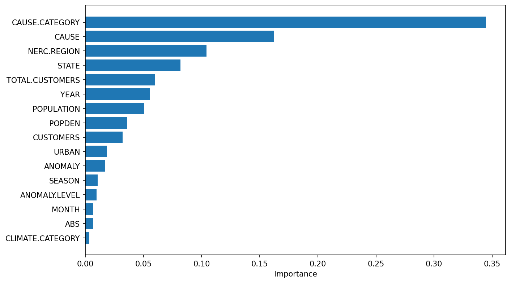
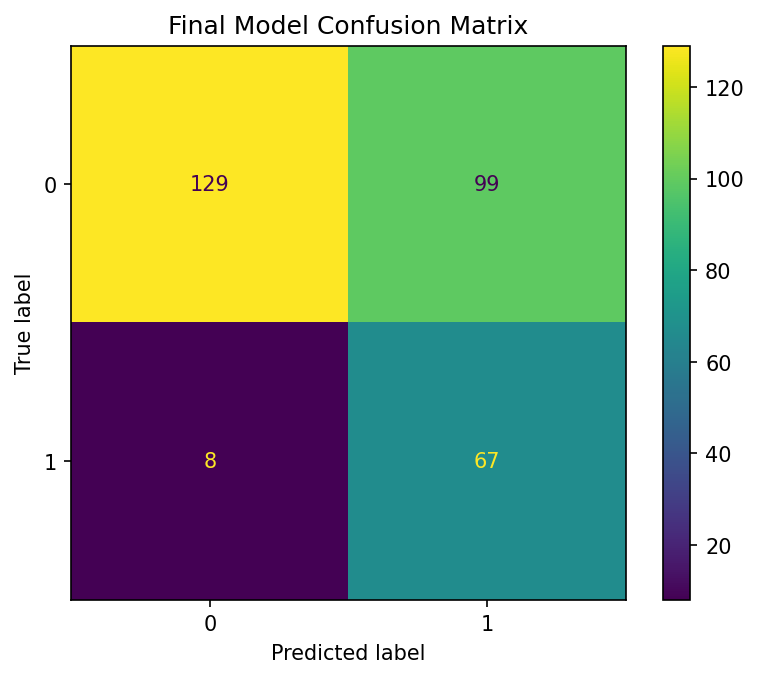

# Predicting Long Power Outages

**Author:** Dylan Craver

This is a data science project analyzing U.S. power outage data to understand which factors lead to prolonged outages and to build a predictive model for identifying outages likely to be "long" (top 25% of duration). This project was completed for DSC 80 at UC San Diego.

---

## Introduction

Power outages affect millions of Americans each year, causing economic disruption, public safety concerns, and reduced quality of life. While some outages are resolved within minutes, others can stretch on for days—or even weeks. Understanding what causes these prolonged outages is crucial for utilities planning infrastructure improvements and emergency response teams preparing for disasters. 

According to the Department of Energy, a “major outage” is one that affects at least 50,000 customers or results in an unexpected loss of 300 megawatts or more. The dataset used in this project comes from Purdue University’s Laboratory for Advancing Sustainable Critical Infrastructure.

**Research Question:** Which causes lead to the longest outages, and can we predict whether an outage will be long?

This analysis uses data from the U.S. Department of Energy's major power outage records, covering **1,534 outage events** from 2000 to 2016 across the continental United States.

### Relevant Columns

| Column | Description |
|--------|-------------|
| `OUTAGE.DURATION` | Duration of outage in minutes (target variable) |
| `CAUSE.CATEGORY` | Category of event causing the outage (e.g., severe weather, intentional attack) |
| `STATE` | U.S. state where outage occurred |
| `NERC.REGION` | Regional grid reliability entity (e.g., WECC, RFC, MRO) |
| `CLIMATE.REGION` | Climate region classification |
| `CLIMATE.CATEGORY` | Warm/Normal/Cold climate episode |
| `ANOMALY.LEVEL` | El Niño/La Niña oceanic index |
| `CUSTOMERS.AFFECTED` | Number of customers impacted |
| `MONTH` | Month when outage occurred |
| `TOTAL.CUSTOMERS` | Total customers in the affected utility service area |

---

## Data Cleaning and Exploratory Data Analysis

### Data Cleaning

The raw dataset required substantial cleaning before analysis:

1. **Combined date/time columns:** Merged `OUTAGE.START.DATE` and `OUTAGE.START.TIME` into a single `OUTAGE.START` datetime, and similarly for restoration times.

2. **Converted data types:** Changed `OUTAGE.DURATION` and `TOTAL.CUSTOMERS` from objects to numeric types.

3. **Removed redundant columns:** Dropped detailed price breakdowns (RES.PRICE, COM.PRICE, IND.PRICE), sector-specific sales data, and geographic detail columns that weren't relevant to the analysis.

4. **Created derived features:** Added `log_duration` for visualization and modeling purposes.

Here's a sample of the cleaned data (first 5 rows, selected columns):

| YEAR | MONTH | STATE     | NERC.REGION | CAUSE.CATEGORY     | OUTAGE.DURATION | CUSTOMERS.AFFECTED |
|------|-------|-----------|-------------|--------------------|-----------------|--------------------|
| 2011 | 7     | Minnesota | MRO         | severe weather     | 3060            | 70000              |
| 2014 | 5     | Minnesota | MRO         | intentional attack | 1               | NaN                |
| 2010 | 10    | Minnesota | MRO         | severe weather     | 3000            | 70000              |
| 2012 | 6     | Minnesota | MRO         | severe weather     | 2550            | 68200              |
| 2015 | 7     | Minnesota | MRO         | severe weather     | 1740            | 250000             |

### Univariate Analysis

The number of reported outages varied significantly over time, with a dramatic spike in 2011 reaching over 250 outages. After this peak, outage counts gradually declined through 2016. The increase around 2011 may reflect improved reporting requirements or an actual increase in grid disruptions during that period.

<iframe
  src="assets/outages_per_year.html"
  width="100%"
  height="500"
  frameborder="0"
></iframe>

The distribution of outage durations is shown on a log scale because the raw data is extremely skewed—most outages last a few hours, but some last weeks. Taking the log compresses these extreme values, making it easier to see patterns in the data. On this scale, a value of 8 corresponds to about 3,000 minutes (~2 days), while a value of 10 represents roughly 22,000 minutes (~15 days).
The histogram shows a bimodal pattern: a small cluster of very short outages near zero, and a larger group peaking around 2 days. The tail extending to the right captures rare but severe outages that lasted much longer.

<iframe
  src="assets/log_duration.html"
  width="100%"
  height="500"
  frameborder="0"
></iframe>

To compare the outage count per region, the **Northeast** region experiences the most outages by far, with over 350 events, followed by the South and West regions. The West North Central region has the fewest outages. This could reflect differences in population density, weather patterns, or grid infrastructure across regions.

<iframe
  src="assets/outage_per_region.html"
  width="100%"
  height="500"
  frameborder="0"
></iframe>

### Bivariate Analysis

System operability disruptions and severe weather affect the most customers on average—both impacting around 200,000 customers per outage. Equipment failures also have a significant reach at nearly 100,000 customers. Interestingly, fuel supply emergencies—which we saw cause the longest outages—affect relatively few customers on average. This suggests that fuel issues create prolonged but localized problems, while severe weather causes widespread but faster-to-resolve outages.

<iframe
  src="assets/avg_customers_affected_cause_category.html"
  width="100%"
  height="500"
  frameborder="0"
></iframe>

This scatter plot shows how often each cause occurs (x-axis) versus how long those outages last on average (y-axis). Severe weather (light blue) is by far the most common cause with nearly 800 outages, but fuel supply emergencies (orange) cause the longest outages—averaging over 13,000 minutes (~9 days)—despite being relatively rare.

<iframe
  src="assets/cause_frequency_vs_avg_duration.html"
  width="100%"
  height="500"
  frameborder="0"
></iframe>

To further explore these findings, here are some visuals:

<iframe
  src="assets/avg_duration_by_cause.html"
  width="100%"
  height="500"
  frameborder="0"
></iframe>

Outage Count by Cause:

<iframe
  src="assets/outages_count_by_cause_cat.html"
  width="100%"
  height="500"
  frameborder="0"
></iframe>

### Interesting Aggregates

The relationship between cause category and climate region reveals important patterns. Fuel supply emergencies in the East North Central region show extraordinarily high average durations (nearly 34,000 minutes), while the same cause type in the Northwest averages just 1 minute—suggesting regional infrastructure differences play a major role.

I have provided a pivot table into an interactive heatmap to show these findingds visually:

<iframe
  src="assets/pivot_table_heatmap.html"
  width="100%"
  height="500"
  frameborder="0"
></iframe>

---

## Assessment of Missingness

### NMAR Analysis

**CUSTOMERS.AFFECTED** is likely Not Missing At Random (NMAR) because:

- Utilities may avoid reporting customer counts when numbers are extremely high (to avoid negative publicity)
- Very small outages might not have customer tracking systems in place
- The missingness depends on the value itself—we can't observe what wasn't reported

Additional data that could make it MAR (Missing At Random):
- Utility company reporting policies
- Whether the utility has smart meter infrastructure to automatically count affected customers

### Missingness Dependency Tests

I tested whether the missingness of `OUTAGE.DURATION` depends on other columns.

**Test 1: Duration Missingness vs. Cause Category**

- **Null Hypothesis:** The distribution of CAUSE.CATEGORY is the same whether OUTAGE.DURATION is missing or not.
- **Alternative Hypothesis:** The distribution differs between missing and non-missing duration groups.
- **Test Statistic:** Total Variation Distance (TVD)

I used a bar chart to compare the distributions because CAUSE.CATEGORY is a categorical variable. Bar charts make it easy to see if certain causes have higher or lower rates of missing duration values compared to others.

<iframe
  src="assets/cause_category_by_missingness_outage_duration.html"
  width="100%"
  height="500"
  frameborder="0"
></iframe>

<iframe
  src="assets/empirical_dist_TVD_cause_cat.html"
  width="100%"
  height="500"
  frameborder="0"
></iframe>

**Result:** Observed TVD = 0.252, p-value = 0.001. I **reject the null hypothesis**—the missingness of duration depends on the cause category. Notably, fuel supply emergencies have a higher rate of missing duration values.

**Test 2: Duration Missingness vs. Total Customers**

- **Null Hypothesis:** The distribution of TOTAL.CUSTOMERS is the same whether OUTAGE.DURATION is missing or not.
- **Alternative Hypothesis:** The distributions differ.
- **Test Statistic:** Kolmogorov-Smirnov (K-S) statistic

I used a KDE (Kernel Density Estimate) plot because TOTAL.CUSTOMERS is a numerical variable. KDE plots show the shape of a distribution as a smooth curve, making it easy to compare whether the two groups (missing vs. not missing) have similar or different distributions.

<iframe
  src="assets/kde_population_missingness_outage_duration.html"
  width="100%"
  height="500"
  frameborder="0"
></iframe>

<iframe
  src="assets/empirical_dist_K-S_total_customers.html"
  width="100%"
  height="500"
  frameborder="0"
></iframe>

**Result:** Observed K-S = 0.1305, p-value = 0.2780. I **fail to reject the null hypothesis**—there's no significant evidence that duration missingness depends on the total customer count. 

---

## Hypothesis Testing

**Question:** Do fuel supply emergency outages last longer than outages from other causes?

Given the dramatic average duration differences observed in EDA, I formally tested whether fuel supply emergencies produce statistically significantly longer outages.

- **Null Hypothesis:** On average, the duration of fuel supply emergency outages equals the duration of all other outages.
- **Alternative Hypothesis:** On average, fuel supply emergency outages last *longer* than other outages.
- **Test Statistic:** Difference in means (fuel supply mean − other causes mean)
- **Significance Level:** α = 0.05

<iframe
  src="assets/dist_mean_diff_outage_duration.html"
  width="100%"
  height="500"
  frameborder="0"
></iframe>

**Results:**
- Fuel supply emergency mean: **13,484 minutes** (~9.4 days)
- Other causes mean: **2,338 minutes** (~1.6 days)
- Observed difference: **11,146 minutes** (~7.7 days)
- **p-value: 0.0000** (none of 10,000 permutations produced a difference as extreme)

**Conclusion:** I reject the null hypothesis. Fuel supply emergency outages are significantly longer than other outages—lasting about 7.7 days longer on average. This makes sense: fuel supply issues affect power generation capacity and may require coordination across multiple facilities to resolve.

---

## Framing a Prediction Problem

**Prediction Task:** Can we predict whether an outage will be "long" (in the top 25% of duration)?

This is a **binary classification problem**:
- **Target variable:** `long_outage` (1 if duration ≥ 75th percentile, 0 otherwise)
- **Features available at prediction time:** Cause category, geographic location, climate conditions, time of year, and demographic characteristics

**Why classification over regression?**
- Extreme outliers in duration make regression challenging
- For emergency planning, knowing "this will be long" vs "this will be short" is more actionable than a specific minute prediction
- The threshold (top 25%) captures the outages most requiring emergency resource allocation

**Evaluation Metric:** F1-score and AUC-ROC
- F1-score balances precision and recall, important given class imbalance (only 25% are "long")
- AUC-ROC evaluates ranking ability across different classification thresholds
- For this application, **recall is especially important**—missing a long outage means emergency teams aren't prepared

---

## Baseline Model

The baseline model uses a **Logistic Regression** classifier with two features:

**Features:**
1. `CAUSE.CATEGORY` (nominal categorical) — One-hot encoded
2. `NERC.REGION` (nominal categorical) — One-hot encoded

**Model Pipeline:**
- ColumnTransformer with OneHotEncoder for categorical features
- LogisticRegression classifier

**Performance:**

| Metric | Value |
|--------|-------|
| Accuracy | 0.640 |
| Precision (long=1) | 0.396 |
| Recall (long=1) | 0.627 |
| F1-Score (long=1) | 0.486 |
| AUC-ROC | 0.729 |

**Assessment:** The baseline model performs okay, with AUC-ROC of 0.729 indicating decent discriminative ability. However, precision is low (many false positives), suggesting room for improvement through feature engineering and model selection.

---

## Final Model

### Feature Engineering

I added several engineered features based on domain knowledge about power grid operations:

1. **SEASON** (derived from MONTH): Power demand and weather patterns vary seasonally. Winter storms and summer heat waves create different outage profiles.

2. **ABS_ANOMALY** (absolute value of ANOMALY.LEVEL): Extreme climate conditions in either direction (strong El Niño or La Niña) can stress the grid.

3. **ANOMALY_X_DENSITY** (ANOMALY.LEVEL × POPDEN_UC): Climate anomalies may have larger effects in densely populated urban centers with complex infrastructure.

4. **CAUSE_REGION** (interaction: CAUSE.CATEGORY + NERC.REGION): The same cause may have different impacts depending on regional infrastructure and response capabilities.

5. **URBAN_RATIO** (POPPCT_URBAN / 100): Urban vs. rural areas have different grid topologies and repair logistics.

6. **CUSTOMERS_PER_POP** (TOTAL.CUSTOMERS / POPULATION): Utility customer density indicates infrastructure load and complexity.

### Model Selection

I chose a **Random Forest Classifier** because:
- Handles mixed feature types well
- Captures non-linear relationships between features and duration
- Resistant to overfitting through ensemble averaging
- Provides feature importance rankings

### Hyperparameter Tuning

Used GridSearchCV with 5-fold cross-validation, optimizing for AUC-ROC:

| Hyperparameter | Search Space | Best Value |
|----------------|--------------|------------|
| n_estimators | [200, 500] | 200 |
| max_depth | [4, 5, 6] | 6 |
| min_samples_leaf | [15, 20, 25] | 15 |
| criterion | [gini] | gini |

### Custom Threshold

For power outage prediction, **false negatives are more costly than false positives**. Missing a long outage means emergency teams aren't prepared, potentially costing lives and extending the crisis. I lowered the classification threshold from 0.5 to 0.4 to prioritize recall. 

### Final Model Performance

| Metric | Baseline | Final Model | Improvement |
|--------|----------|-------------|-------------|
| Accuracy | 0.640 | 0.647 | +1.1% |
| Precision (long=1) | 0.396 | 0.404 | +2.0% |
| Recall (long=1) | 0.627 | **0.893** | +42.4% |
| F1-Score (long=1) | 0.486 | 0.556 | +14.4% |
| AUC-ROC | 0.729 | **0.816** | +11.9% |

I noticed slight overfitting with a gap at 0.0684 with the data but with limited data of ~1500 outages, I decided to proceed. 

| === Overfitting Check === |
|---------------------------|
| Train Accuracy: 0.7822 |
| Test Accuracy:  0.6469 | 
| Train AUC:      0.8844 | 
| Test AUC:       0.8160 | 
| CV AUC:         0.8506 | 
| Gap (Train-Test AUC): 0.0684 |

### Feature Importance

I was curious to see which predictors were most important to the Random Forest model, so I computed the feature importances
(using mean decrease in Gini impurity) and aggregated one-hot encoded columns back to their original features.

**Key Improvements:**
- **Recall jumped from 62.7% to 89.3%**—the model now catches almost 90% of truly long outages
- AUC improved significantly (0.729 → 0.816), indicating better overall discrimination
- The tradeoff is slightly more false alarms, but this is acceptable for emergency preparedness. It is best to be overly cautious.

---

## Fairness Analysis

**Question:** Does the model perform equally well across different regions of the power grid?

I compared model performance between:
- **Group A:** WECC region (Western Electricity Coordinating Council—Western U.S.)
- **Group B:** Non-WECC regions (all other NERC regions)

WECC covers areas with unique challenges: wildfires, extreme heat waves, and long transmission distances across mountainous terrain.

**Evaluation Metric:** F1-score (accounts for both precision and recall on the imbalanced target)

**Hypotheses:**
- **Null:** The model is fair—F1-scores for WECC and non-WECC outages are equal, and any observed difference is due to chance.
- **Alternative:** The model is unfair—F1-score differs significantly between groups.

**Test:** Permutation test with 5,000 iterations, shuffling NERC region labels and computing the F1 difference each time.

<iframe
  src="assets/fairness_analysis.html"
  width="100%"
  height="500"
  frameborder="0"
></iframe>

**Results:**
- WECC F1-score: Lower than non-WECC
- p-value: **0.0016**

**Conclusion:** I reject the null hypothesis. The model performs significantly worse on WECC region outages compared to other regions. This indicates a **potential fairness concern**—the model may be less reliable for predicting long outages in the Western U.S.

Possible explanations:
- WECC has unique outage patterns (wildfires, Public Safety Power Shutoffs) underrepresented in training data
- Western infrastructure characteristics differ from Eastern grid design
- Climate and geography create different restoration challenges

**Future Work:** Develop region-specific models or gather additional features capturing Western U.S. grid characteristics.

---

## Conclusion

This analysis revealed that **fuel supply emergencies** cause dramatically longer outages than other causes—averaging 9.4 days compared to 1.6 days for other causes. The final Random Forest model achieves 89% recall for predicting long outages, enabling emergency response teams to prepare resources proactively.

However, the fairness analysis identified that performance varies by region, with Western U.S. outages being harder to predict. This suggests the need for continued model refinement and potentially region-specific approaches.

**Key Takeaways:**
1. Fuel supply emergencies, though rare, require the most emergency planning resources
2. Machine learning can identify likely long outages with high recall (89%)
3. Geographic disparities in model performance warrant attention for equitable emergency response
